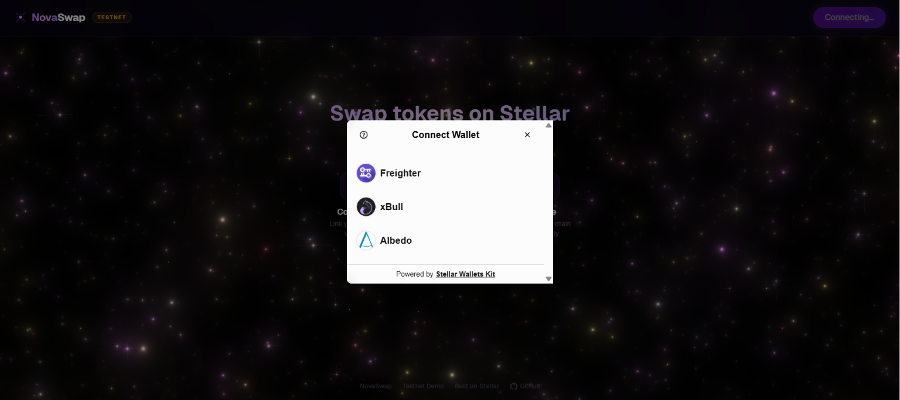
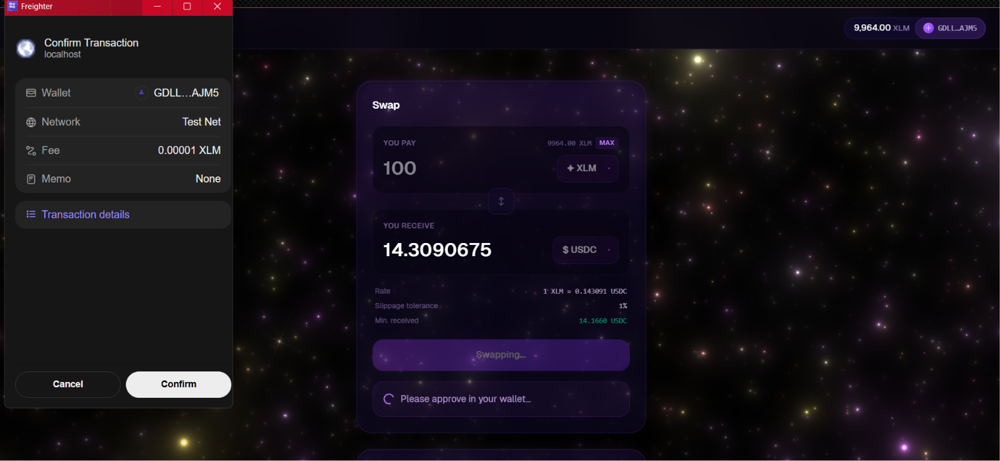

# NovaSwap

A decentralized token swap interface built on the Stellar testnet. Swap XLM and USDC directly against the Stellar DEX orderbook with real-time activity tracking powered by a Soroban smart contract.

## Live Demo

[https://novaswap01.netlify.app](https://novaswap01.netlify.app)

## Screenshots

### Landing Page


### Wallet Connect Options


### Transaction


## Features

- **Multi-Wallet Support** — Connect via Freighter, xBull, or Albedo using StellarWalletsKit
- **DEX Orderbook Swaps** — Executes `pathPaymentStrictSend` against live SDEX liquidity
- **Soroban Contract Logging** — Every swap is recorded on-chain via a deployed Soroban contract
- **Live Activity Feed** — Real-time event polling shows recent swaps as they happen
- **Transaction Status Tracking** — Pending, success, and error states with Stellar Explorer links
- **7 Error Types Handled** — `user_rejected`, `insufficient_balance`, `no_liquidity`, `slippage`, `wallet_not_found`, `wallet_error`, `tx_failed`
- **Auto Trustline Creation** — Automatically creates USDC trustline on first swap
- **Interactive Galaxy Background** — WebGL star field with mouse repulsion

## Tech Stack

- React + Vite + Bun
- Tailwind CSS v4
- @stellar/stellar-sdk
- @creit.tech/stellar-wallets-kit
- Soroban smart contract (Rust)

## Setup

```bash
# Install dependencies
bun install

# Start dev server
bun run dev

# Build for production
bun run build
```

## Deployed Contract

- **Network:** Stellar Testnet
- **Contract ID:** `CC7BLI4HA6JABI5ABXYXEXCKAMWXNRL7F2GBVMSVRI6PNXO4ZBSALYQQ`
- **Explorer:** [View on Stellar Expert](https://stellar.expert/explorer/testnet/contract/CC7BLI4HA6JABI5ABXYXEXCKAMWXNRL7F2GBVMSVRI6PNXO4ZBSALYQQ)

## Contract Call Transaction

- **Transaction Hash:** `06873cb64922370cddaf43d8475a28df5e29e0c6ab0615845a91ffdfa7871cb0`
- **Explorer:** [View on Stellar Expert](https://stellar.expert/explorer/testnet/tx/06873cb64922370cddaf43d8475a28df5e29e0c6ab0615845a91ffdfa7871cb0)

## Wallet Options

The app supports three Stellar wallets via StellarWalletsKit:

1. Freighter
2. xBull
3. Albedo

## Architecture

- **Swap settlement** happens on classic Stellar via `pathPaymentStrictSend` against the SDEX orderbook
- **Activity logging** is a separate Soroban contract layer — it records swaps but does not custody funds
- Settlement and logging are **decoupled** — the swap is the only required signature, logging is best-effort

## Project Structure

```
src/
  lib/
    constants.js    — Testnet URLs, asset codes
    assets.js       — XLM/USDC asset definitions
    stellar.js      — Horizon server, balance fetching
    swap.js         — Swap engine (trustline, build tx, submit)
    contract.js     — Soroban contract integration
  hooks/
    useWallet.js    — Multi-wallet connection hook
    useOrderbook.js — Live orderbook polling
    useActivityFeed.js — Event-driven activity feed
  components/
    Header.jsx, WalletButton.jsx, SwapPanel.jsx,
    AssetSelector.jsx, TxStatus.jsx, ActivityFeed.jsx,
    ErrorBanner.jsx, Galaxy.jsx, Footer.jsx
contract/
  src/lib.rs        — NovaSwapLog Soroban contract
```
